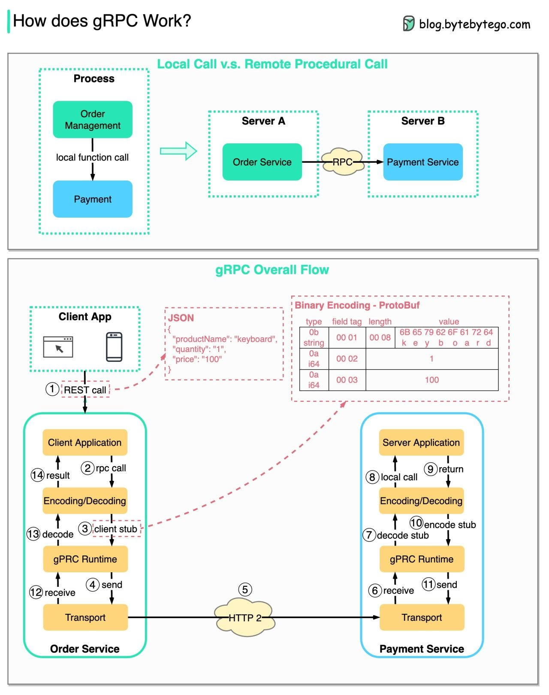

# Welcome to gRPC-Demo-Apps 👋

[](#)
[](https://twitter.com/jellydn)

> Demo some concepts for Grpc with NodeJS

## Prerequisites

- node >=14.0.0
- [buf](https://github.com/bufbuild/buf)

## Install

```sh
yarn install
```

## Usage

```sh
yarn dev
```

## Applications

- hello: simple Typescript implementation of hello world RPC from gRPC nodejs
  [example](https://github.com/grpc/grpc/blob/master/examples/node/dynamic_codegen/README.md).


- hello-go: small
  [Connect service](https://connect.build/docs/go/getting-started) with Go.


- modern-hello: the rewrite version of hello app with
  [protobuf-es](https://github.com/bufbuild/protobuf-es)


- web: a hello nextjs 13 app with 2 Grpc services


More detail of each readme file on each application.

## Resources

- [grpc](https://grpc.io/): A high performance, open source universal RPC
  framework
- [protobuf-es](https://github.com/bufbuild/protobuf-es):Protocol Buffers for
  ECMAScript.
- [connect-web](https://github.com/bufbuild/connect-web): Simple, reliable,
  interoperable. A better gRPC-Web.
- [connect-go](https://github.com/bufbuild/connect-go): Simple, reliable,
  interoperable. A better gRPC.
- [@grpc/grpc-js](https://github.com/grpc/grpc-node/tree/master/packages/grpc-js):
  Pure JavaScript gRPC Client
- [@grpc/proto-loader](https://github.com/grpc/grpc-node/tree/master/packages/proto-loader):
  A utility package for loading .proto files for use with gRPC, using the latest
  Protobuf.js package.
- [grpc-web](https://github.com/improbable-eng/grpc-web): gRPC Web
  implementation for Golang and TypeScript

## Useful References

- [Building a secure API with gRPC](https://snyk.io/blog/building-a-secure-api-with-grpc/)
- [Connect: A better gRPC](https://buf.build/blog/connect-a-better-grpc)
- [Protobuf-ES: The Protocol Buffers TypeScript/JavaScript runtime we all deserve](https://buf.build/blog/protobuf-es-the-protocol-buffers-typescript-javascript-runtime-we-all-deserve)

### How does gPRC Work?

Thank you for the excellent image from
[bytebytego](https://blog.bytebytego.com).



## Author

👤 **Dung Huynh**

- Website: https://productsway.com/
- Twitter: [@jellydn](https://twitter.com/jellydn)
- Github: [@jellydn](https://github.com/jellydn)

## Show your support

[](https://github.com/jellydn/grpc-demo-monorepo/stargazers)

Give a ⭐️ if this project helped you!

---

_This README was generated with ❤️ by
[readme-md-generator](https://github.com/kefranabg/readme-md-generator)_
